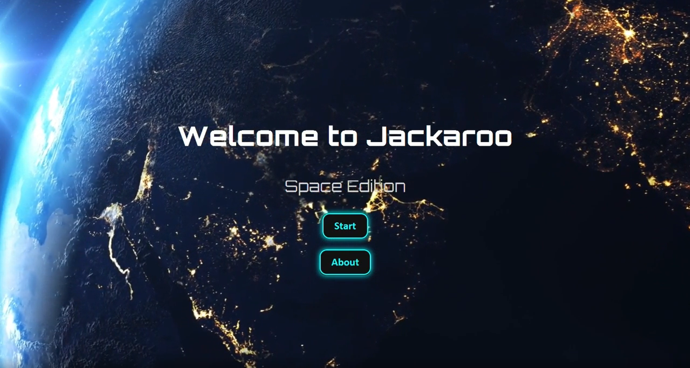
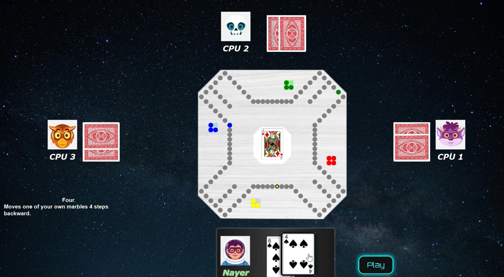
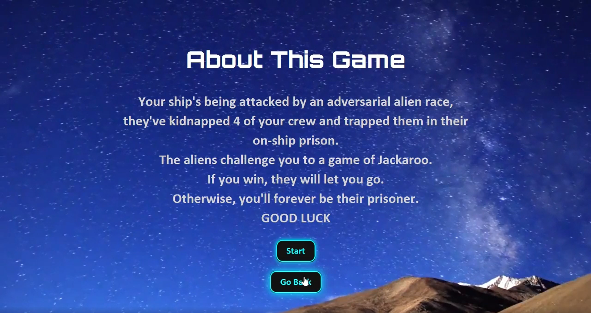

# 🪐 Space Jackaroo

A **space-themed reimagining** of the classic board game **Jackaroo**, developed as a university project.  
This version combines complete game logic with a clean, modern graphical interface, all wrapped in a futuristic cosmic aesthetic.

> A reminder that even course projects can be a canvas for creativity ✨

---

## 📸 Preview

## 🎮 About the Game

Jackaroo is a strategic board game that blends **card mechanics**, **player movement**, and **team-based play**.  
In this project, we preserved the core rules of the original game while reimagining its presentation with a **space-inspired board** and a **sleek, intuitive UI**.

---

## 🧠 Features

- ✅ Fully implemented Jackaroo game mechanics  
- 🪐 Custom-designed **space-themed board**  
- 🎴 Card-based turn system  
- 👥 Multiplayer logic with turn management  
- 🖥️ Clean and intuitive graphical user interface  
- 🧩 Modular, object-oriented design  

---

## 🛠️ Tech Stack & Concepts

- **Object-Oriented Programming (OOP)**
- **Game Logic & State Management**
- **GUI Development**
- **Event Handling**
- **Team Collaboration & Version Control**

---

## 🖼️ UI & Design

The interface was designed to feel **modern, minimal, and immersive**, reinforcing the space theme without sacrificing clarity or usability.

---

## 🤝 Team Members

- **Nayer Basim**
- **Youssef Figary**
- **Zyad El-Habashy**

Big shoutout to the team for the collaboration and creative energy that brought this project to life 🚀

---

## 📚 What We Learned

- Translating real-world game rules into robust software logic  
- Designing maintainable systems using OOP principles  
- Balancing creativity with technical constraints  
- Working effectively as a development team under deadlines  
